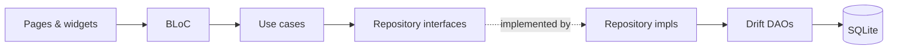
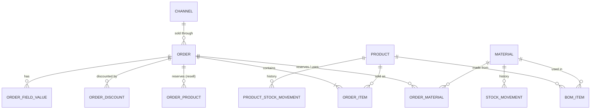

# Craftbook — Code Architecture & Development Guide

## Project Overview

**Craftbook** is an offline-first Android application for small craft businesses to track orders, manage materials (BOM), and calculate real profit. It treats every order as a material consumer — when you save an order, it reserves pieces; when you pack, it deducts them.

### Core Value Proposition
- **Offline-first**: No accounts, no sync. All data lives on-device. The one network call is the user-triggered update check (`features/updates`), which only reads public GitHub releases.
- **BOM-aware orders**: Orders are created with products, but the app expands them into materials behind the scenes.
- **Real profit tracking**: Profit = What the customer paid − Tax − Materials (actual, including waste) − Channel fees − Shipping. Discounts lower what the customer paid.
- **Getting paid**: Orders are paid or unpaid; unpaid ones show as accounts receivable.
- **Stock as pips**: Visual representation of stock levels showing free vs. promised pieces.

### Target Platform
- **Android only** (Flutter)
- **Minimum SDK**: API 24 (Android 7.0) — set by `flutter.minSdkVersion`
- **Target SDK**: API 36 (Android 16) — set by `flutter.targetSdkVersion`
- **Compile SDK**: API 36 — set by `flutter.compileSdkVersion`

---

## Tech Stack

| Layer | Technology | Purpose |
|-------|-----------|---------|
| UI Framework | Flutter 3.x | Cross-platform UI (Android target) |
| State Management | flutter_bloc | Predictable state management with BLoC pattern |
| Local Database | SQLite via Drift ORM | Type-safe database access with code generation |
| Dependency Injection | get_it (manual registration) | Service locator in `lib/core/di/injection.dart` |
| Navigation | go_router | Declarative routing with bottom nav shell |
| Date/Time | intl | Date formatting and localization |
| Charts | fl_chart | Simple charts for earnings visualization |
| File Picker | file_picker | SQLite backup export/import |
| Updates | github_release_apk_updater | In-app updates from GitHub releases |
| Testing | mocktail + bloc_test | Unit and widget testing |

---

## Architecture Overview

This project follows **Clean Architecture** with a **feature-first** directory structure. Each feature contains its own presentation, domain, and data layers.

```
lib/
├── core/           # Theme, widgets, utils, DI, error types, constants
├── database/       # Drift tables, DAOs, migrations
├── features/       # Feature modules (today, orders, stock, products, earnings, settings)
│   └── <feature>/
│       ├── presentation/  (pages, bloc, widgets)
│       ├── domain/        (entities, usecases, repositories)
│       └── data/          (repository impls)
└── app.dart        # MaterialApp, routing, theme
```

### Layer Responsibilities

| Layer | Responsibility | Dependencies |
|-------|---------------|--------------|
| **Presentation** | UI rendering, user interaction, state management | Domain (Use Cases, Entities) |
| **Domain** | Business logic, use cases, entity definitions | None (pure Dart) |
| **Data** | Data persistence, repository implementations | Domain (Entities, Repository interfaces) |

### Feature Modules

| Feature | Route(s) | Key Pages |
|---------|----------|-----------|
| **Today** | `/` | Dashboard, week calendar, month calendar |
| **Orders** | `/orders`, `/orders/new`, `/orders/:id` | List (tabbed), creation wizard, detail view |
| **Stock** | `/materials`, `/materials/:id` | Materials list (tabbed, opened from More), detail, receive stock, buy list |
| **Products** | `/products`, `/products/:id/edit`, `/channels` | List (a bottom-nav tab, with the Buy list shortcut), BOM editor, channels & fees |
| **Reports** (`features/earnings`) | `/reports`, `/reports/:productId` | Week/month/year/custom period, `ReportFilter` sheet, money breakdown (discounts, tax), per-product, waste, Waiting for payment card. The bottom-nav tab is labelled "Reports"; the folder and classes keep the `earnings` name |
| **Receivables** (`features/orders`) | `/receivables` | Unpaid, non-cancelled orders grouped by customer (`GetReceivables`, `ReceivablesCubit`). Opened from Reports and More |
| **Discounts** | `/discounts` | Discount presets (percent or fixed): list, add/edit sheet, drag to reorder. Orders copy them as lines (`order_discounts`) |
| **Settings** | `/settings`, `/order-fields` | Backup/restore, navigation hub, custom order fields, Currency sheet (`CurrencyCubit`), Tax sheet (`TaxSettingsCubit`) |
| **Notes** | `/notes`, `/notes/new`, `/notes/:id` | Notebook list with search, full-screen rich-text editor; pinned notes show on Today |
| **Updates** | (row on `/settings`) | "Check for updates": finds the latest GitHub release, shows its notes, downloads the APK and opens Android's installer. Only runs when tapped |
| **Social links** | `/social-links` | Shortcuts to the shop's Facebook, TikTok, Shopee, Lazada… pages: brand-tile grid, add/edit sheet, drag to reorder. Links open outside the app via `LinkLauncher` |

---

### Code layout

The UI never touches the database directly:



```
lib/
├── app.dart              # MaterialApp, light/dark themes, go_router routes
├── core/
│   ├── di/               # get_it registrations (everything is wired here)
│   ├── theme/            # CraftColors (light + dark), type scale, radii/spacing
│   ├── widgets/          # shared UI: AppCard, PipStrip, MoneyBreakdown, …
│   └── utils/ error/ constants/ services/
├── database/             # Drift tables, DAOs, migrations
└── features/
    ├── today/            # dashboard + calendar
    ├── orders/           # list, new/edit wizard, details, pack, adjust, receivables
    ├── stock/            # materials, receive, buy list
    ├── products/         # products, BOM editor, channels
    ├── discounts/        # discount presets
    ├── earnings/         # Reports tab
    ├── order_fields/ notes/ social_links/
    ├── settings/         # More tab, backup/restore, currency, tax, appearance
    └── updates/          # check GitHub releases, download and install
```

### Data model



`ORDER_MATERIAL` keeps both the **planned** and the **actual** quantity; the difference is waste. Discount presets, notes, social links and settings (a key/value table: theme, palette, order amount, currency, tax) stand alone.

---

## Key Business Rules

1. **Stock Reservation**: When an order is saved, materials are **reserved** (promised) but not deducted. The `quantity_promised` field on Material tracks this.

2. **Stock Deduction**: When an order is **packed**, materials are actually deducted from `quantity_on_hand`. The `quantity_promised` is also reduced.

3. **Waste Tracking**: The `order_materials` table stores both planned and actual quantities. The difference is waste, which affects profit calculation.

4. **Weighted Average Cost**: When receiving stock, the unit cost is recalculated:
   ```
   new_unit_cost = (old_qty × old_cost + new_qty × new_price) / (old_qty + new_qty)
   ```

5. **Profit Calculation**: `OrderMoney` (`features/orders/domain/entities/order_money.dart`) is the one place order money is worked out. Never write the formula by hand:
   ```
   discount     = Σ discount lines, capped at the items total (orders.total_sales)
   net          = items total − discount
   tax          = included: net × r ÷ (1 + r)    added on top: net × r
   customerPays = included: net                  added on top: net + tax
   fees         = channel.calculateFees(customerPays)   // after discount
   profit       = customerPays − tax − materials − fees − shipping
   ```
   **Do NOT trust stored `order.profit`**. It can go stale after material adjustments. Use `OrderMoney.fromOrder(order)`, `Order.liveProfit` or `Order.liveTotal` (what the customer pays). `CalculateOrderProfit` returns an `OrderMoney`; reports sum `OrderMoney`s in `EarningsRepositoryImpl`.

6. **Buildable Quantity**: For a product, the maximum buildable quantity is:
   ```
   min(free × bom_item.makes ÷ bom_item.quantity_required) for all BOM items
   ```
   A BOM line is "`quantity_required` pieces make `makes` products" (schema v10, default 1), e.g. 1 sheet makes 9 cards. Cost per product is `BomItem.lineCost` (÷ makes); an order line reserves `BomItem.piecesFor(qty)`, rounded up to whole pieces because stock is counted in whole pieces. Use those helpers rather than multiplying `quantityRequired` by hand.

7. **Safe Deletion**: Orders blocked when shipped. Materials blocked when used in a BOM or in any order; their stock history goes with them. Products blocked when in orders or have BOM items; their stock history goes with them too. Channels blocked when orders reference them.

8. **Earnings Scope**: Earnings include both **packed and shipped** orders. Waste also only counts from packed/shipped orders.

9. **Cancelling**: Any order that isn't cancelled can be cancelled. Cancelling releases a pending order's reservations or restores a packed or shipped order's deducted stock (a shipped one came back or never went). Shipped orders can't be deleted directly; cancel first, then delete. Stock goes back through `ReturnOrderStock` (shared with `DeleteOrder`), and the order stays on record as cancelled. Deleting a cancelled order returns nothing, since its stock already came back. A cancelled order can be restored (`RestoreOrder`): it always goes back to pending and reserves its planned materials again, even if it had been packed. Cancelled orders stay off Today and the calendars, and only show under the Orders tab's Cancelled chip.

10. **Archiving**: Products and materials have `isArchived` (schema v8, which replaced the product's "show in new orders" `isActive`). Archived items stay on past orders, earnings and history, but are left out of list pages (except under their Archived chip), the order wizard's product picker, the BOM editor's material picker, low-stock alerts, the buy list and the Settings counts. Archive is what's offered when a delete is blocked.

11. **Discounts**: An order has any number of discount lines (`order_discounts`: label, percent/fixed, value, worked-out amount); `orders.discount_total` holds their sum for reports. Presets (`discount_presets`) are copied onto orders, never referenced, so they can always be edited or deleted. Discounts can change while an order is pending or packed.

12. **Tax**: Settings hold enabled/onByDefault/rate/inclusive/label. `enabled` gives every order a tax switch (`TaxSettings.available`); `onByDefault` decides whether a new order starts with it on (`TaxSettings.forNewOrder`). The order stores its own `tax_rate`, `tax_inclusive` and `tax_amount` (null rate = no tax), so changing the setting never rewrites old orders. Tax included in prices reduces profit; tax added on top is passed through and doesn't.

13. **Paid status**: `orders.is_paid` / `paid_at`. A new order's default comes from its channel's `paid_by_default` (there's no global default, because every order has a channel). `SetOrderPaid` works at any status except cancelled. Unpaid orders still count toward profit in reports; `EarningsSummary.unpaidTotal` shows how much of it is owed. Receivables are all-time, not tied to a report period.

---

## UI Conventions

- **Colours**: never use `AppColors` or `Colors.*` in widgets. Read `context.colors` (`CraftColors` in `lib/core/theme/colors.dart`) so light and dark both work.
- **Type**: `AppTextStyles` (`lib/core/theme/text_styles.dart`) carries no colour; add it with `copyWith`. Nothing smaller than `monoTag` (10px). Letter spacing is in px.
- **Shape and spacing**: `AppRadii` and `AppSpacing` (`lib/core/theme/dimens.dart`). Page bodies use `AppSpacing.page`.
- **Build from shared widgets** in `lib/core/widgets/` before writing a new container: `AppCard`, `CardList`/`CardRow`, `SectionLabel`, `AppTag`, `MoneyBreakdown`, `SummaryBoard`, `StatTile`, `EmptyState`, `BottomActionBar`, `ChoiceChipRow`, `PipStrip`, `showAppSheet`, `showActionSheet`, `ProductPhoto` / `showPhotoViewer` (product thumbnails with an initial as fallback). Rich text (order notes, the notebook) uses `NoteView`, `NoteToolbar` and `NoteStyles` in `lib/core/widgets/note/`, stored as Delta JSON via `NoteCodec`.
- **Long press** on a list item opens its actions via `showActionSheet`. Each entity's menu lives in one place (`ProductActions`, `MaterialActions`, `OrderActions`, `NoteActions`, or a `_xActions` function on the page) and returns `true` when the caller should reload. A new list of things that can be edited or deleted gets the same menu.
- **Order status** maps to a pill only through `OrderStatusPill` (`lib/features/orders/presentation/widgets/order_status_ui.dart`). User-facing name for pending is "To pack".
- **Money**: `CurrencyFormatter` / `CurrencyText`; `formatShort` for headline numbers. The currency is the user's choice: never write `₱` (or any symbol) in code; input prefixes use `'${CurrencyFormatter.symbol} '`. Profit is always `MoneyParts(...).profit`, `OrderMoney.profit` or `Order.liveProfit`; order money is drawn with `OrderMoney.parts` (`order_status_ui.dart`), which carries discount and tax into `MoneyBreakdown`.
- **Screenshots**: `flutter test --run-skipped --tags screenshots --update-goldens` renders every screen into `test/screenshots/goldens/` using the sample shop in `test/support/sample_data.dart`. Review them after UI changes.

---

## State Management Pattern

Each feature uses the **BLoC pattern**:

```dart
// Event: User actions
abstract class OrdersListEvent extends Equatable {}
class LoadOrders extends OrdersListEvent {}

// State: UI state
class OrdersListState extends Equatable {
  final List<Order> orders;
  final bool isLoading;
  final String? error;
}

// BLoC: Business logic
class OrdersListBloc extends Bloc<OrdersListEvent, OrdersListState> {
  final GetOrdersUseCase getOrders;
  OrdersListBloc({required this.getOrders}) : super(OrdersListInitial()) {
    on<LoadOrders>(_onLoadOrders);
  }
}
```

---

## Dependency Injection

Using `get_it` with manual registration in `lib/core/di/injection.dart`:

```dart
final getIt = GetIt.instance;

Future<void> configureDependencies() async {
  final db = AppDatabase();
  getIt.registerSingleton<AppDatabase>(db);

  // DAOs
  getIt.registerSingleton(OrderDao(db));
  // ...

  // Repositories
  getIt.registerLazySingleton<OrderRepository>(
    () => OrderRepositoryImpl(getIt<OrderDao>()),
  );

  // Use Cases
  getIt.registerFactory(() => GetOrders(getIt()));

  // BLoCs
  getIt.registerFactory(() => OrdersListBloc(getOrders: getIt()));
}
```

---

## Navigation

Using `go_router` with a `ShellRoute` for the 5 bottom nav tabs (Today, Orders, Products, Reports, More; Materials sits under More) and push routes for detail pages. Pages that are also pushed from the order wizard (channels, order fields, discounts) are top-level routes outside the shell.

- Tab switches use `context.go()` (replace)
- Detail pages use `context.push()` (push)
- Child pages pop with `context.pop(true)` after successful operations
- Parent pages `await` the push result and reload their BLoC

**Auto-refresh pattern**: After any create/edit/delete, child pages pop with `true`. Parent pages check the result and dispatch a reload event.

---

## Error Handling

All use cases return `Result<T>` using a custom sealed class hierarchy:

```dart
// lib/core/error/result.dart
sealed class Result<T> {
  const Result();
}

class Success<T> extends Result<T> {
  final T value;
  const Success(this.value);
}

class Error<T> extends Result<T> {
  final Failure failure;
  const Error(this.failure);
}

// lib/core/error/failures.dart
abstract class Failure {
  final String message;
  const Failure(this.message);
}

class DatabaseFailure extends Failure {}
class ValidationFailure extends Failure {}
class NotFoundFailure extends Failure {}
```

Handle results with pattern matching:

```dart
switch (result) {
  case Success(:final value):
    // Handle success
  case Error(:final failure):
    // Handle error
}
```

---

## Testing Strategy

**MANDATORY RULE: When working on any feature, always write test cases.** Every use case must have unit tests, every BLoC must have `bloc_test` coverage, and every new widget must have a widget test.

| Level | Tool | Coverage Target |
|-------|------|----------------|
| Unit Tests | `test`, `mocktail` | Use cases, BLoCs, repositories |
| Widget Tests | `flutter_test` | Key widgets (PipStrip, StepperInput, etc.) |

### Testing Requirements
1. **Every use case** — happy path + each validation failure
2. **Every BLoC** — each event handler, verify correct state emissions
3. **Every new widget** — renders correctly with expected data
4. **Business logic** — profit calculation, stock reservation/deduction, BOM expansion, weighted average cost

### Result Types in Tests
The custom `Result` sealed class has proper equality, so you can use direct assertions:
```dart
// Direct equality works
expect(result, Success<void>(null));
expect(result, Error<void>(const ValidationFailure('Invalid')));

// Pattern matching for complex assertions
switch (result) {
  case Success(:final value):
    expect(value, expectedValue);
  case Error(:final failure):
    expect(failure, isA<ValidationFailure>());
}
```

---

## Coding Standards

### Naming Conventions
- **Files**: `snake_case.dart`
- **Classes**: `PascalCase`
- **Variables/Methods**: `camelCase`
- **Constants**: `camelCase` (not SCREAMING_CAPS)
- **Private members**: `_prefixWithUnderscore`

### Comments
- Document **why**, not **what**
- Use `///` for public API documentation

### Formatting
- All Dart code is formatted with `dart format` (default settings, no custom line length). Run `dart format .` before finishing any change; `dart format --output=none --set-exit-if-changed .` must exit cleanly.
- Generated files (`*.g.dart`) are formatted too, so run it after `dart run build_runner build`.
- Don't hand-align code or wrap lines to taste; the formatter's output is the standard.

### Linting
- Run `flutter analyze` before finishing any change and fix **every** issue it reports, including `info`-level messages. There is no such thing as an acceptable info; the codebase stays at "No issues found!".
- Try `dart fix --apply` first for mechanical fixes (e.g. `prefer_const_constructors`, `use_super_parameters`), then fix the rest by hand.
- Don't silence a lint with `// ignore:` unless it's a false positive, and say why in the comment.

### Error Handling
- Never swallow errors silently
- Always show user-friendly error messages

---

## Database Migrations

The schema is at **v10** (BOM `makes`). Every schema change must:
1. Increment `currentSchemaVersion` in `app_database.dart`
2. Add a raw-SQL `if (from < N)` step in `migrations.dart`, matching what Drift would create
3. Handle data preservation during migration
4. Run `dart run build_runner build` to regenerate code
5. Add `test/database/migration_vN_test.dart` and a `downgradeToV(N-1)` in `test/support/legacy_schema.dart` (chained from the older ones)

---

## Backup & Export

Raw SQLite file copy via `file_picker` (`lib/core/services/backup_service.dart`):
- **Export**: Reads `craftbook.sqlite` as bytes, passes to `FilePicker.saveFile()` (Android SAF compatible)
- **Import**: Picks a file, copies over current DB (or writes bytes), prompts restart

---

## Releases

`.github/workflows/release.yml` runs on every push to `main`: analyze, test, build a signed APK, publish a GitHub release tagged `v<major>.<minor>.<commit count>`. The in-app updater compares that tag with the installed `versionName`, so never publish an APK whose version doesn't match its tag.

- **Version:** major and minor come from `pubspec.yaml`; the patch is the commit count on `main` (`1.0.73` is the 73rd commit). Bump `pubspec.yaml` for a new minor or major.
- **Signing:** Android only installs an update signed with the same key as the installed app, so every release must use the same keystore. Losing it means users have to uninstall and reinstall. Release signing reads `android/key.properties` (written by CI from repo secrets). Without it, release builds fall back to the debug key, which is fine locally but can't update an installed release.
- To set up the key once:
  ```bash
  keytool -genkeypair -v -keystore craftbook-release.jks -alias craftbook \
    -keyalg RSA -keysize 2048 -validity 10000
  base64 -w0 craftbook-release.jks   # paste into ANDROID_KEYSTORE_BASE64
  ```
  Then add these repository secrets: `ANDROID_KEYSTORE_BASE64`, `ANDROID_KEYSTORE_PASSWORD`, `ANDROID_KEY_ALIAS` (`craftbook`) and `ANDROID_KEY_PASSWORD`. The workflow won't publish without them. To sign a local release build with the same key, create `android/key.properties` (git-ignored) with `storeFile`, `storePassword`, `keyAlias` and `keyPassword`.
- The updater plugin declares its own FileProvider. Don't add another one for it in `AndroidManifest.xml`.

---

## Development Workflow

1. **Branch naming**: `feature/feature-name`, `fix/bug-name`, `refactor/description`
2. **Commit messages**: Conventional commits (`feat:`, `fix:`, `docs:`, etc.)
3. **After adding plugins**: Run `flutter clean && flutter pub get` then full rebuild (hot restart won't register native code)

### Getting Started

Requires Flutter 3.x (Dart SDK ≥ 3.5) and the Android SDK.

```bash
flutter pub get
dart run build_runner build   # regenerate Drift code after schema changes
flutter run
dart format .                 # the whole codebase stays formatted
flutter analyze               # must report "No issues found!"
flutter test                  # use cases, BLoCs, widgets, repositories on in-memory SQLite
flutter test --run-skipped --tags screenshots --update-goldens   # every screen, light + dark
```

---

## Documentation

**MANDATORY RULE: when a change adds or changes anything a user can see or do, update `README.md` in the same change.** The README is bundled as an asset and shown on the in-app About page, so it is the user guide: write it for shop owners, in plain words, describing what to tap and what happens. Keep developer detail (code, architecture, build, release) out of it; that belongs here. Also update the feature table in `docs/project.md`.

- **[README.md](README.md)**: The user guide, shown in the app under More → About.
- **This file (AGENTS.md)**: Code architecture, patterns, and technical conventions.
- **[docs/project.md](docs/project.md)**: Business context, feature status, and current state.
- **[docs/craftbook-ui-flow.html](docs/craftbook-ui-flow.html)**: Interactive UI flow mockup.

---

*This document is the single source of truth for code architecture. All implementation decisions should align with these patterns.*
