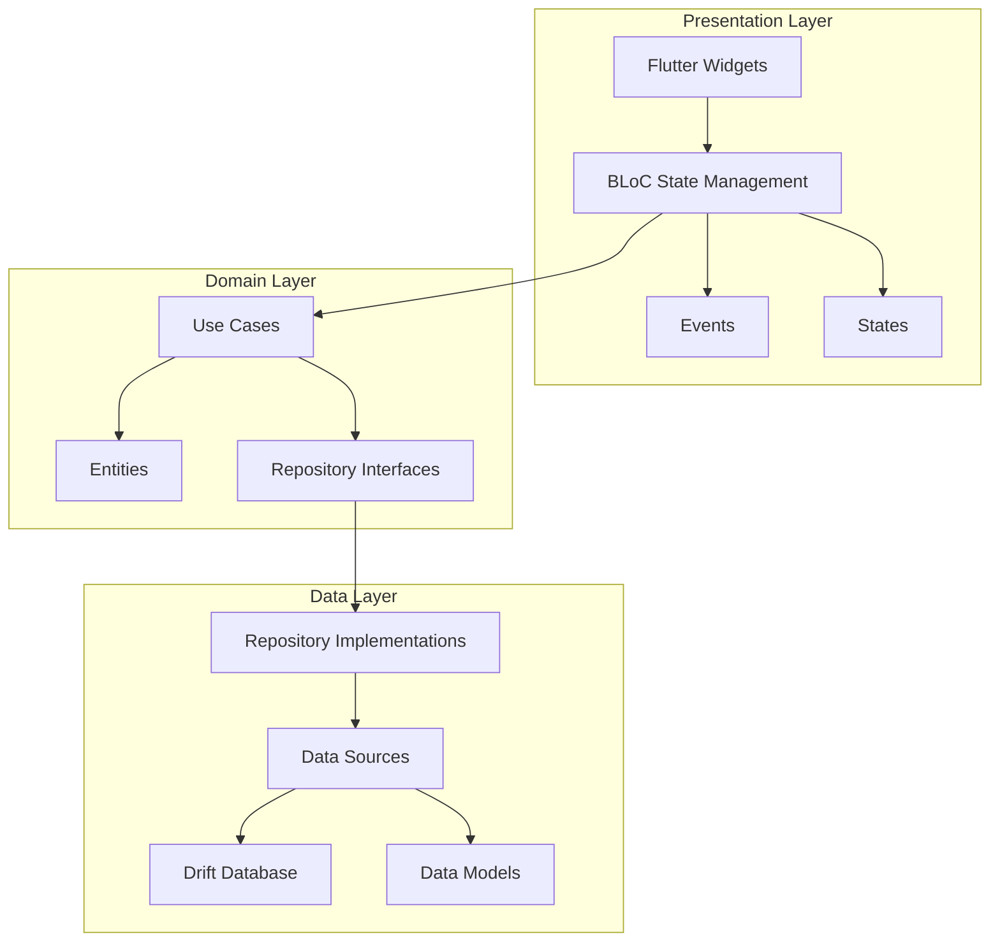
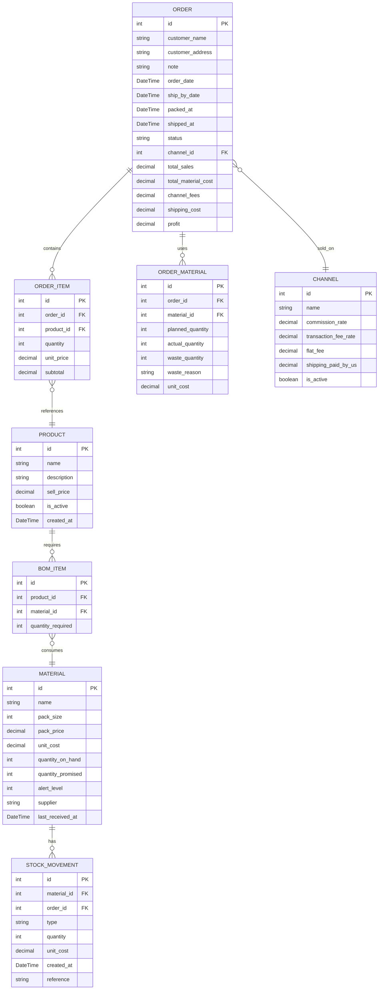

# Craftbook — Code Architecture & Development Guide

## Project Overview

**Craftbook** is an offline-first Android application for small craft businesses to track orders, manage materials (BOM), and calculate real profit. It treats every order as a material consumer — when you save an order, it reserves pieces; when you pack, it deducts them.

### Core Value Proposition
- **Offline-first**: No accounts, no sync, no network calls. All data lives on-device.
- **BOM-aware orders**: Orders are created with products, but the app expands them into materials behind the scenes.
- **Real profit tracking**: Profit = Sales − Materials (actual, including waste) − Channel fees − Shipping.
- **Stock as pips**: Visual representation of stock levels showing free vs. promised pieces.

### Target Platform
- **Android only** (Flutter)
- **Minimum SDK**: API 21 (Android 5.0) — set by `flutter.minSdkVersion`
- **Target SDK**: API 36 (Android 16) — set by `flutter.targetSdkVersion`
- **Compile SDK**: API 36 — set by `flutter.compileSdkVersion`

---

## Tech Stack

| Layer | Technology | Purpose |
|-------|-----------|---------|
| UI Framework | Flutter 3.x | Cross-platform UI (Android target) |
| State Management | flutter_bloc | Predictable state management with BLoC pattern |
| Local Database | SQLite via Drift ORM | Type-safe database access with code generation |
| Dependency Injection | get_it + injectable | Service locator with compile-time code generation |
| Navigation | go_router | Declarative routing with deep linking support |
| Date/Time | intl | Date formatting and localization |
| Charts | fl_chart | Simple charts for earnings visualization |
| Testing | mocktail + bloc_test | Unit and widget testing |

---

## Architecture Overview

This project follows **Clean Architecture** with a **feature-first** directory structure. Each feature contains its own presentation, domain, and data layers, while shared utilities and core infrastructure live in a common module.



### Layer Responsibilities

| Layer | Responsibility | Dependencies |
|-------|---------------|--------------|
| **Presentation** | UI rendering, user interaction, state management | Domain (Use Cases, Entities) |
| **Domain** | Business logic, use cases, entity definitions | None (pure Dart) |
| **Data** | Data persistence, API calls (none here), repository implementations | Domain (Entities, Repository interfaces) |

---

## Directory Structure

```
lib/
├── main.dart                          # App entry point, DI setup
├── app.dart                           # MaterialApp configuration, theme, routing
│
├── core/                              # Shared infrastructure
│   ├── constants/
│   │   ├── app_constants.dart         # App-wide constants (limits, defaults)
│   │   └── route_names.dart           # Route name constants
│   ├── theme/
│   │   ├── app_theme.dart             # Theme configuration
│   │   ├── colors.dart                # Color palette (matches UI mockup)
│   │   └── text_styles.dart           # Typography
│   ├── widgets/                       # Reusable UI components
│   │   ├── pip_strip.dart             # Pip visualization widget
│   │   ├── stepper_input.dart         # +/- stepper widget
│   │   ├── status_pill.dart           # Status badge (READY, SHORT, etc.)
│   │   ├── currency_text.dart         # Peso-formatted text
│   │   └── confirm_dialog.dart        # Reusable confirmation dialog
│   ├── utils/
│   │   ├── currency_formatter.dart    # PHP currency formatting
│   │   ├── date_utils.dart            # Date helpers
│   │   └── extensions.dart            # Dart extensions
│   └── error/
│       ├── failures.dart              # Failure types for error handling
│       └── exceptions.dart            # Custom exceptions
│
├── features/                          # Feature modules
│   │
│   ├── today/                         # Flow 1: Day view
│   │   ├── presentation/
│   │   │   ├── pages/
│   │   │   │   ├── today_page.dart           # Main today screen (1.1)
│   │   │   │   ├── calendar_week_page.dart   # Week view (1.2)
│   │   │   │   └── calendar_month_page.dart  # Month view (1.3)
│   │   │   ├── bloc/
│   │   │   │   ├── today_bloc.dart
│   │   │   │   ├── today_event.dart
│   │   │   │   └── today_state.dart
│   │   │   └── widgets/
│   │   │       ├── order_card.dart
│   │   │       ├── alert_banner.dart
│   │   │       ├── week_lane.dart
│   │   │       └── month_calendar.dart
│   │   ├── domain/
│   │   │   ├── entities/
│   │   │   │   └── daily_summary.dart
│   │   │   ├── usecases/
│   │   │   │   ├── get_today_orders.dart
│   │   │   │   ├── get_week_orders.dart
│   │   │   │   └── get_alert_summary.dart
│   │   │   └── repositories/
│   │   │       └── order_repository.dart     # Interface only
│   │   └── data/
│   │       ├── repositories/
│   │       │   └── order_repository_impl.dart
│   │       └── datasources/
│   │           └── order_local_datasource.dart
│   │
│   ├── orders/                        # Flow 2: Order creation & management
│   │   ├── presentation/
│   │   │   ├── pages/
│   │   │   │   ├── orders_list_page.dart     # Orders list (2.1)
│   │   │   │   ├── new_order_page.dart       # Multi-step order creation
│   │   │   │   ├── order_details_page.dart   # Order detail view (3.1)
│   │   │   │   └── adjust_materials_page.dart # Material adjustment (3.2)
│   │   │   ├── bloc/
│   │   │   │   ├── orders_list_bloc.dart
│   │   │   │   ├── new_order_bloc.dart
│   │   │   │   └── order_detail_bloc.dart
│   │   │   └── widgets/
│   │   │       ├── order_list_card.dart
│   │   │       ├── product_picker_sheet.dart
│   │   │       ├── review_summary.dart
│   │   │       └── pack_confirm_dialog.dart
│   │   ├── domain/
│   │   │   ├── entities/
│   │   │   │   ├── order.dart
│   │   │   │   ├── order_item.dart
│   │   │   │   ├── order_material.dart
│   │   │   │   └── order_status.dart
│   │   │   ├── usecases/
│   │   │   │   ├── create_order.dart
│   │   │   │   ├── update_order.dart
│   │   │   │   ├── pack_order.dart
│   │   │   │   ├── ship_order.dart
│   │   │   │   ├── adjust_materials_used.dart
│   │   │   │   ├── calculate_order_profit.dart
│   │   │   │   └── reserve_materials.dart
│   │   │   └── repositories/
│   │   │       └── order_repository.dart
│   │   └── data/
│   │       ├── models/
│   │       │   ├── order_model.dart
│   │       │   └── order_item_model.dart
│   │       ├── repositories/
│   │       │   └── order_repository_impl.dart
│   │       └── datasources/
│   │           └── order_local_datasource.dart
│   │
│   ├── stock/                         # Flow 4: Stock management
│   │   ├── presentation/
│   │   │   ├── pages/
│   │   │   │   ├── materials_list_page.dart  # Materials list (4.1)
│   │   │   │   ├── material_detail_page.dart # Material detail (4.2)
│   │   │   │   ├── receive_stock_page.dart   # Receive stock (4.3)
│   │   │   │   └── buy_list_page.dart        # What to buy (4.4)
│   │   │   ├── bloc/
│   │   │   │   ├── materials_bloc.dart
│   │   │   │   ├── material_detail_bloc.dart
│   │   │   │   └── buy_list_bloc.dart
│   │   │   └── widgets/
│   │   │       ├── material_card.dart
│   │   │       ├── stock_movement_list.dart
│   │   │       └── buy_list_card.dart
│   │   ├── domain/
│   │   │   ├── entities/
│   │   │   │   ├── material.dart
│   │   │   │   ├── stock_movement.dart
│   │   │   │   └── buy_list_item.dart
│   │   │   ├── usecases/
│   │   │   │   ├── get_materials.dart
│   │   │   │   ├── get_material_detail.dart
│   │   │   │   ├── receive_stock.dart
│   │   │   │   ├── adjust_stock.dart
│   │   │   │   ├── get_buy_list.dart
│   │   │   │   └── get_blocked_products.dart
│   │   │   └── repositories/
│   │   │       └── material_repository.dart
│   │   └── data/
│   │       ├── models/
│   │       │   └── material_model.dart
│   │       ├── repositories/
│   │       │   └── material_repository_impl.dart
│   │       └── datasources/
│   │           └── material_local_datasource.dart
│   │
│   ├── products/                      # Flow 5: Products & BOM
│   │   ├── presentation/
│   │   │   ├── pages/
│   │   │   │   ├── products_list_page.dart   # Products list (5.1)
│   │   │   │   ├── product_editor_page.dart  # BOM editor (5.2)
│   │   │   │   └── channels_page.dart        # Channels & fees (5.3)
│   │   │   ├── bloc/
│   │   │   │   ├── products_bloc.dart
│   │   │   │   ├── product_editor_bloc.dart
│   │   │   │   └── channels_bloc.dart
│   │   │   └── widgets/
│   │   │       ├── product_card.dart
│   │   │       ├── bom_editor_list.dart
│   │   │       └── channel_card.dart
│   │   ├── domain/
│   │   │   ├── entities/
│   │   │   │   ├── product.dart
│   │   │   │   ├── bom_item.dart
│   │   │   │   └── channel.dart
│   │   │   ├── usecases/
│   │   │   │   ├── get_products.dart
│   │   │   │   ├── create_product.dart
│   │   │   │   ├── update_product.dart
│   │   │   │   ├── calculate_bom_cost.dart
│   │   │   │   ├── calculate_buildable_quantity.dart
│   │   │   │   ├── get_channels.dart
│   │   │   │   └── update_channel.dart
│   │   │   └── repositories/
│   │   │       ├── product_repository.dart
│   │   │       └── channel_repository.dart
│   │   └── data/
│   │       ├── models/
│   │       │   ├── product_model.dart
│   │       │   └── channel_model.dart
│   │       ├── repositories/
│   │       │   ├── product_repository_impl.dart
│   │       │   └── channel_repository_impl.dart
│   │       └── datasources/
│   │           ├── product_local_datasource.dart
│   │           └── channel_local_datasource.dart
│   │
│   ├── earnings/                      # Flow 6: Earnings
│   │   ├── presentation/
│   │   │   ├── pages/
│   │   │   │   ├── earnings_page.dart        # Earnings overview (6.1)
│   │   │   │   └── product_earnings_page.dart # Per-product drill-down (6.2)
│   │   │   ├── bloc/
│   │   │   │   ├── earnings_bloc.dart
│   │   │   │   └── product_earnings_bloc.dart
│   │   │   └── widgets/
│   │   │       ├── earnings_summary_card.dart
│   │   │       ├── product_profit_card.dart
│   │   │       └── earnings_chart.dart
│   │   ├── domain/
│   │   │   ├── entities/
│   │   │   │   ├── earnings_summary.dart
│   │   │   │   └── product_earnings.dart
│   │   │   ├── usecases/
│   │   │   │   ├── get_earnings_summary.dart
│   │   │   │   ├── get_product_earnings.dart
│   │   │   │   └── get_waste_summary.dart
│   │   │   └── repositories/
│   │   │       └── earnings_repository.dart
│   │   └── data/
│   │       ├── repositories/
│   │       │   └── earnings_repository_impl.dart
│   │       └── datasources/
│   │           └── earnings_local_datasource.dart
│   │
│   └── settings/                      # Settings & Configuration
│       ├── presentation/
│       │   ├── pages/
│       │   │   └── settings_page.dart
│       │   └── bloc/
│       │       └── settings_bloc.dart
│       ├── domain/
│       │   ├── entities/
│       │   │   └── app_settings.dart
│       │   └── usecases/
│       │       ├── get_settings.dart
│       │       ├── update_settings.dart
│       │       ├── export_backup.dart
│       │       └── import_backup.dart
│       └── data/
│           └── repositories/
│               └── settings_repository_impl.dart
│
└── database/                          # Drift database layer
    ├── app_database.dart              # Main database class
    ├── tables/
    │   ├── orders_table.dart
    │   ├── order_items_table.dart
    │   ├── order_materials_table.dart
    │   ├── materials_table.dart
    │   ├── products_table.dart
    │   ├── bom_items_table.dart
    │   ├── channels_table.dart
    │   ├── stock_movements_table.dart
    │   └── settings_table.dart
    ├── daos/
    │   ├── order_dao.dart
    │   ├── material_dao.dart
    │   ├── product_dao.dart
    │   ├── channel_dao.dart
    │   └── earnings_dao.dart
    └── migrations/
        └── migrations.dart            # Database schema migrations
```

---

## Data Models

### Core Entities



### Key Business Rules

1. **Stock Reservation**: When an order is saved, materials are **reserved** (promised) but not deducted. The `quantity_promised` field on Material tracks this.

2. **Stock Deduction**: When an order is **packed**, materials are actually deducted from `quantity_on_hand`. The `quantity_promised` is also reduced.

3. **Waste Tracking**: The `ORDER_MATERIAL` table stores both planned and actual quantities. The difference is waste, which affects profit calculation.

4. **Weighted Average Cost**: When receiving stock, the unit cost is recalculated as a weighted average:
   ```
   new_unit_cost = (old_qty × old_cost + new_qty × new_price) / (old_qty + new_qty)
   ```

5. **Profit Calculation**:
   ```
   profit = sales - actual_material_cost - channel_fees - shipping
   ```

6. **Buildable Quantity**: For a product, the maximum buildable quantity is:
   ```
   min(material.quantity_on_hand / bom_item.quantity_required) for all BOM items
   ```

---

## State Management Pattern

Each feature uses the **BLoC pattern** with the following structure:

```dart
// Event: User actions
abstract class OrdersListEvent extends Equatable {}
class LoadOrders extends OrdersListEvent {}
class FilterByStatus extends OrdersListEvent {
  final OrderStatus status;
}

// State: UI state
class OrdersListState extends Equatable {
  final List<Order> orders;
  final bool isLoading;
  final String? error;
  final OrderStatus? filter;
}

// BLoC: Business logic
class OrdersListBloc extends Bloc<OrdersListEvent, OrdersListState> {
  final GetOrdersUseCase getOrders;
  
  OrdersListBloc({required this.getOrders}) : super(OrdersListInitial()) {
    on<LoadOrders>(_onLoadOrders);
    on<FilterByStatus>(_onFilterByStatus);
  }
}
```

---

## Dependency Injection

Using `get_it` with `injectable` for code generation:

```dart
// lib/core/di/injection.dart
final getIt = GetIt.instance;

@InjectableInit()
Future<void> configureDependencies() async => getIt.init();

// Usage in features
@Injectable()
class GetOrdersUseCase {
  final OrderRepository repository;
  GetOrdersUseCase(this.repository);
}
```

---

## Navigation

Using `go_router` with named routes:

```dart
// lib/core/constants/route_names.dart
class RouteNames {
  static const today = '/';
  static const calendarWeek = '/calendar/week';
  static const calendarMonth = '/calendar/month';
  static const orders = '/orders';
  static const newOrder = '/orders/new';
  static const orderDetail = '/orders/:id';
  static const materials = '/materials';
  static const materialDetail = '/materials/:id';
  static const products = '/products';
  static const productEditor = '/products/:id/edit';
  static const channels = '/channels';
  static const earnings = '/earnings';
  static const settings = '/settings';
}
```

---

## Error Handling

All use cases return `Either<Failure, Success>` using the `dartz` package:

```dart
// lib/core/error/failures.dart
abstract class Failure {
  final String message;
  Failure(this.message);
}

class DatabaseFailure extends Failure {}
class ValidationFailure extends Failure {}
class NotFoundFailure extends Failure {}

// Use case signature
class GetOrdersUseCase {
  Future<Either<Failure, List<Order>>> call(OrderFilter filter);
}
```

---

## Testing Strategy

**MANDATORY RULE: When working on any feature, always write test cases.** Every use case must have unit tests, every BLoC must have `bloc_test` coverage, and every new widget must have a widget test. No feature is considered complete without its tests.

| Level | Tool | Coverage Target |
|-------|------|----------------|
| Unit Tests | `test`, `mocktail` | Use cases, BLoCs, repositories |
| Widget Tests | `flutter_test` | Key widgets, pip strip, stepper |
| Integration Tests | `integration_test` | Critical flows (create order, pack) |

### Testing Requirements
1. **Every use case** — at least one test for the happy path, one for each validation failure
2. **Every BLoC** — test each event handler using `bloc_test`, verify correct states are emitted
3. **Every new widget** — widget test verifying it renders correctly with expected data
4. **Business logic** — dedicated tests for profit calculation, stock reservation/deduction, BOM expansion, weighted average cost

### Testing Priorities
1. **Profit calculation** — must be exact
2. **Stock reservation/deduction** — must be atomic
3. **BOM expansion** — must correctly calculate material needs
4. **Weighted average cost** — must update correctly on stock receipt

---

## Coding Standards

### Naming Conventions
- **Files**: `snake_case.dart`
- **Classes**: `PascalCase`
- **Variables/Methods**: `camelCase`
- **Constants**: `camelCase` (not SCREAMING_CAPS)
- **Private members**: `_prefixWithUnderscore`

### File Organization
Each file should contain:
1. Imports (Dart SDK, Flutter, packages, project)
2. One public class per file (exception: closely related events/states)
3. Private helper classes at the bottom

### Comments
- Document **why**, not **what**
- Use `///` for public API documentation
- Use `//` for implementation notes

### Error Handling
- Never swallow errors silently
- Always show user-friendly error messages
- Log errors to a local file for debugging

---

## Database Migrations

Drift supports schema migrations. Every schema change must:
1. Increment the schema version in `app_database.dart`
2. Add a migration step in `migrations.dart`
3. Handle data preservation during migration

```dart
@DriftDatabase(tables: [Orders, OrderItems, ...])
class AppDatabase extends _$AppDatabase {
  AppDatabase() : super(_openConnection());
  
  @override
  int get schemaVersion => 2;  // Increment on changes
  
  @override
  MigrationStrategy get migration {
    return MigrationStrategy(
      onCreate: (Migrator m) => m.createAll(),
      onUpgrade: (Migrator m, int from, int to) async {
        if (from < 2) {
          await m.alterTable(TableMigration.orders));
        }
      },
    );
  }
}
```

---

## Performance Considerations

1. **Pagination**: Orders list should paginate (50 items per page)
2. **Lazy Loading**: Material detail loads movements on demand
3. **Computed Fields**: Profit and buildable quantity are computed, not stored
4. **Indexes**: Add indexes on frequently queried columns:
   - `orders.status`
   - `orders.ship_by_date`
   - `stock_movements.material_id`
   - `order_materials.material_id`

---

## Backup & Export

Since the app is offline-only, backup is critical:
- **Export**: Single JSON file with all data
- **Import**: Restore from JSON file
- **Location**: User chooses via file picker
- **Frequency**: Remind user weekly to backup

---

## Future Considerations

- **Multi-currency**: Currently PHP only, but structure should support extension
- **Reports**: PDF export of earnings, waste reports
- **Barcode scanning**: For receiving stock
- **Cloud sync**: Optional, via user's own Google Drive

---

## Development Workflow

1. **Branch naming**: `feature/feature-name`, `fix/bug-name`, `refactor/description`
2. **Commit messages**: Conventional commits (`feat:`, `fix:`, `docs:`, etc.)
3. **Code review**: Required before merge to main
4. **CI/CD**: Run tests and lint on every PR

---

## Getting Started

```bash
# Install dependencies
flutter pub get

# Run code generation (Drift, injectable)
dart run build_runner build

# Run the app
flutter run

# Run tests
flutter test
```

---

## Documentation

- **This file (AGENTS.md)**: Code architecture, patterns, and technical conventions — the single source of truth for *how* to build.
- **[docs/project.md](docs/project.md)**: Business context, feature status, and current state — the single source of truth for *what* has been built and *what's next*.
- **[docs/craftbook-ui-flow.html](docs/craftbook-ui-flow.html)**: Interactive UI flow mockup — visual reference for the 6 user flows and screen layouts.

**Keep both files in sync.** When completing features, updating architecture, or changing project state, update the relevant doc. Stale docs lead to stale context.

**General rule:** Always document decisions, changes, and progress in the `docs/` folder when possible. Future-you (and your AI assistant) will thank you.

---

*This document is the single source of truth for code architecture. All implementation decisions should align with these patterns.*
