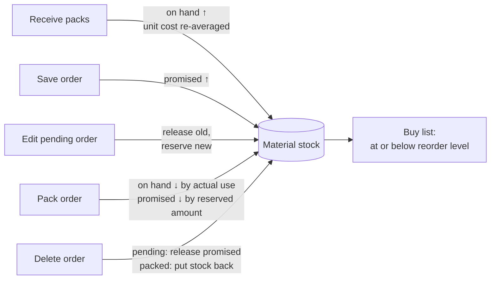
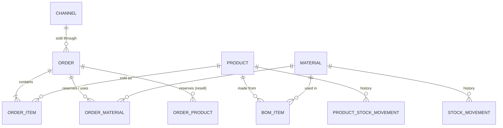
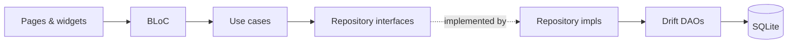

# Craftbook

Craftbook is an offline Android app for small craft businesses: people who make crochet bouquets, beaded phone straps or resin keychains and sell them on Shopee, TikTok Shop or at a market table.

It answers three everyday questions:

- **What do I need to pack today?**
- **Do I have enough materials, and what should I buy?**
- **How much did I actually make,** after materials, waste, platform fees and shipping?

Everything stays on the phone. There are no accounts, no sync and no network calls. You can export the whole database to a file as a backup.

---

## How it works in one paragraph

You list your **materials** (yarn, wire, beads, boxes) and your **products**, and tell the app how many of each material one product uses (its bill of materials, or BOM). When you save an **order**, the app works out which materials it needs and **reserves** them, so you can see what's promised before you've touched anything. When you **pack** the order, those pieces come off the shelf for real. **Profit** is always calculated from its parts: sales minus the materials actually used (waste included), channel fees and shipping.

---

## Using the app

The bottom bar has five tabs: **Today**, **Orders**, **Stock**, **Money** and **More**.

### 1. Set up once

| Step | Where | What you enter |
|------|-------|----------------|
| Add sales channels | More → Channels & fees | Commission %, transaction fee %, fixed fee, shipping you pay. Each card shows what you keep on an example sale. |
| Add materials | Stock → **+ Material** | Pieces per pack, pack price (unit cost is worked out for you), supplier, pieces on hand, reorder level. |
| Add products | More → Products → **+ Product** | Sell price, then either **Handmade** (pick the materials one piece uses) or **Resell** (bought ready-made, with its own stock and unit cost). The editor shows profit per piece and margin as you type. |

### 2. Day to day

1. **Today** shows what's due: a summary of orders to pack, new orders, overdue orders and this week's profit. It also shows a warning when materials run low, and the orders shipping today or placed today. The calendar icon opens a week or month view by ship-by date.
2. **New order** (the **+** button) takes three steps:
   - **Customer:** name, your order fields (address, size, wrap… set up under More → Order fields), channel, order and ship-by dates, note.
   - **Items:** pick products. The picker shows how many you can build right now.
   - **Review:** the profit preview, the fee and shipping split, and exactly which materials will be reserved. It warns you if any are short.
3. **Pack** the order from its detail page. A sheet shows each material's stock before and after. If you used more than planned, tap **Adjust** first and record the real amount and the reason (cutting, defect, and so on). The extra is tracked as waste.
4. **Mark shipped** when it goes out.
5. **Edit** an order from its menu. What you can change depends on how far the order has got:

   | Status | Editable |
   |--------|----------|
   | To pack | Everything. Changing items releases the old reservations and makes new ones. |
   | Packed | Customer, order fields, note, dates and channel. Items are locked because their stock is already gone. |
   | Shipped | The note only. |

### 3. Keeping stock healthy

- **Stock** lists every material with a **pip strip**, one block per piece:

  | Pip | Meaning |
  |-----|---------|
  | Solid green | Free to use |
  | Hatched red | Promised to an open order |
  | Grey | Empty space up to the reorder level |
  | Thin black tick | The reorder level |

  If orders promise more than you have, the card says how many you're short.
- **Receive** on a material adds packs and recalculates the unit cost as a weighted average. The new cost is previewed before you save.
- **Count** sets the on-hand number after a physical count.
- **Edit material** (⋮ menu on its page) changes the name, pack size, pack price, supplier or reorder level.
- **Buy list** (Stock or More) lists everything at or below its reorder level: how many packs to buy, the cost, and which open orders it's holding up. **Copy list** puts it on the clipboard so you can paste it into a chat with your supplier.

### 4. Money

**Money** shows net profit for a week, month or year. The view includes:

- a bar chart by day (or by month for a year)
- a breakdown bar and lines for sales, materials, fees and shipping
- profit per product (tap one to see the orders behind it)
- waste for the period

Only **packed and shipped** orders count.

### 5. Backups

More → **Export backup** saves the SQLite file wherever you choose. **Restore from backup** replaces everything on the phone with a backup file; restart the app afterwards.

---

## How things connect

### The stock lifecycle



**Resell** products follow the same lifecycle with their own on-hand and promised counts instead of materials.

### Where profit comes from

```
profit = sales − materials actually used − channel fees − shipping you pay
```

- **Channel fees** = sales × (commission % + transaction fee %) + the fixed fee.
- **Materials actually used** includes waste recorded with Adjust.
- Profit is recalculated whenever it's shown. The `profit` column stored on an order is never trusted, because it goes stale when materials are adjusted.
- Per-product profit splits each order's profit across its products by share of sales.

### Data model



`ORDER_MATERIAL` keeps both the **planned** and the **actual** quantity. The difference is waste.

### Code layout

The app follows Clean Architecture with feature folders. The UI never touches the database directly.



```
lib/
├── app.dart              # MaterialApp, light/dark themes, go_router routes
├── core/
│   ├── di/               # get_it registrations (everything is wired here)
│   ├── theme/            # CraftColors (light + dark), type scale, radii/spacing
│   ├── widgets/          # shared UI: AppCard, PipStrip, MoneyBreakdown, …
│   └── utils/ error/ constants/ services/
├── database/             # Drift tables, DAOs, migrations
└── features/
    ├── today/            # dashboard + calendar
    ├── orders/           # list, new/edit wizard, details, pack, adjust
    ├── stock/            # materials, receive, buy list
    ├── products/         # products, BOM editor, channels
    ├── earnings/         # Money tab
    └── settings/         # More tab, backup/restore
```

Each feature has `presentation/` (pages, BLoCs, widgets), `domain/` (entities, use cases, repository interfaces) and `data/` (repository implementations). Use cases return a `Result<T>` (`Success` or `Error`) instead of throwing.

---

## Development

### Requirements

- Flutter 3.x (Dart SDK ≥ 3.5)
- Android SDK (min API 21, target/compile API 36)

### Run it

```bash
flutter pub get
dart run build_runner build   # regenerate Drift code after schema changes
flutter run
```

### Checks

```bash
flutter analyze   # must report "No issues found!", info-level hints included
flutter test      # use cases, BLoCs, widgets, repositories on in-memory SQLite
```

### Screenshots of every screen

There's no need for a device to review the UI. This command renders every screen in light and dark mode, using a seeded sample shop (`test/support/sample_data.dart`):

```bash
flutter test --run-skipped --tags screenshots --update-goldens
```

The PNGs land in `test/screenshots/goldens/`, which is git-ignored.

### Further reading

- [AGENTS.md](AGENTS.md): architecture, business rules, UI conventions and coding standards. Read this before changing code.
- [docs/project.md](docs/project.md): feature status and design decisions.
